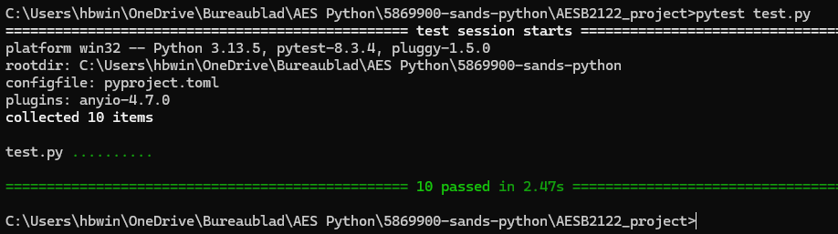

# Signal Processing Package

A Python package for creating, analyzing, and processing various types of signals with comprehensive signal operations and visualization capabilities.

### Signal Generation
- Sine waves - Standard sinusoidal signals
- Square waves - Binary amplitude signals with sharp transitions
- Triangle waves - Linear rising/falling signals
- Sawtooth waves - Linear ramp signals with sharp resets
- Unit step signals - Heaviside step functions

### Signal Operations
- Time shifting - Delay or advance signals in time
- Time scaling - Compress or expand signals temporally
- Amplitude scaling - Modify signal amplitude by constant factors
- Signal addition - Element-wise sum of two signals
- Signal multiplication - Element-wise product of two signals

### Visualization
- Side-by-side comparison plots (original vs. modified signals)
- Matplotlib-based plotting with customizable layouts

### Tests
Tests verifying whether signals and operations are done properly
